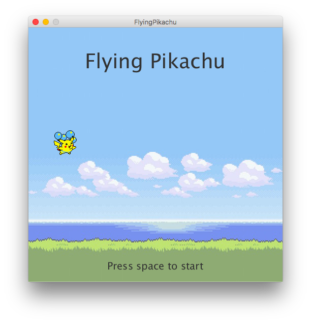
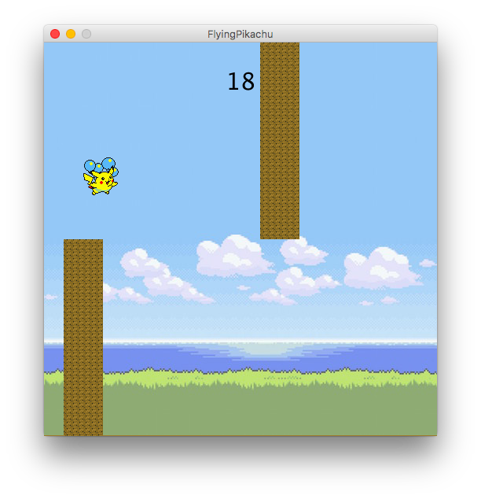
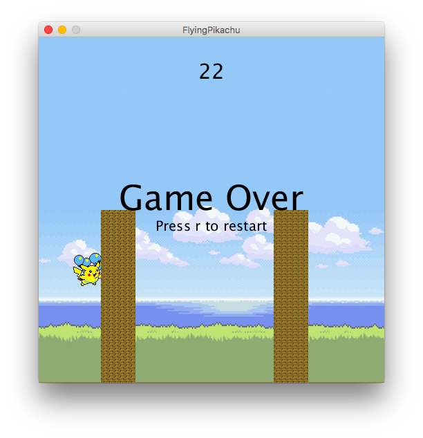

# FlyingPikachu

Flappy bird clone with Pokémon theme made in Processing. This game was used as instructional material for Mission Bit's Android Game Development class.

## Requirements
* [Processing 3.0+](https://processing.org/)
* Processing Sound Library

## Screenshots

